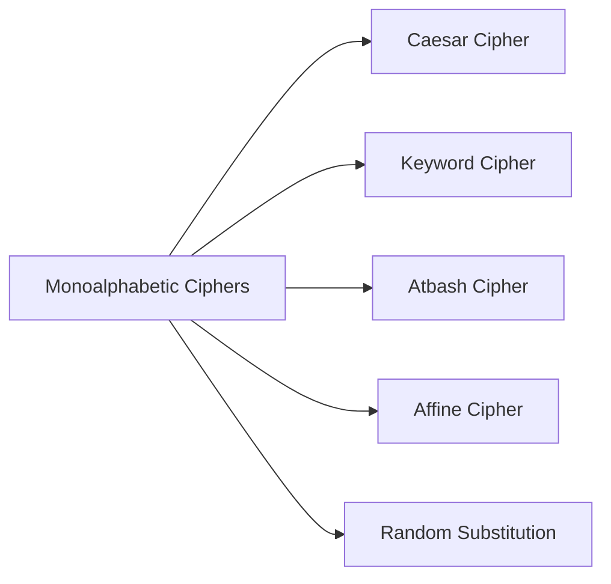
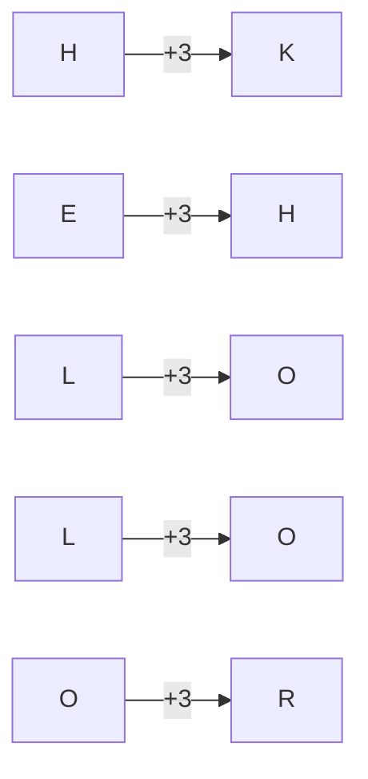
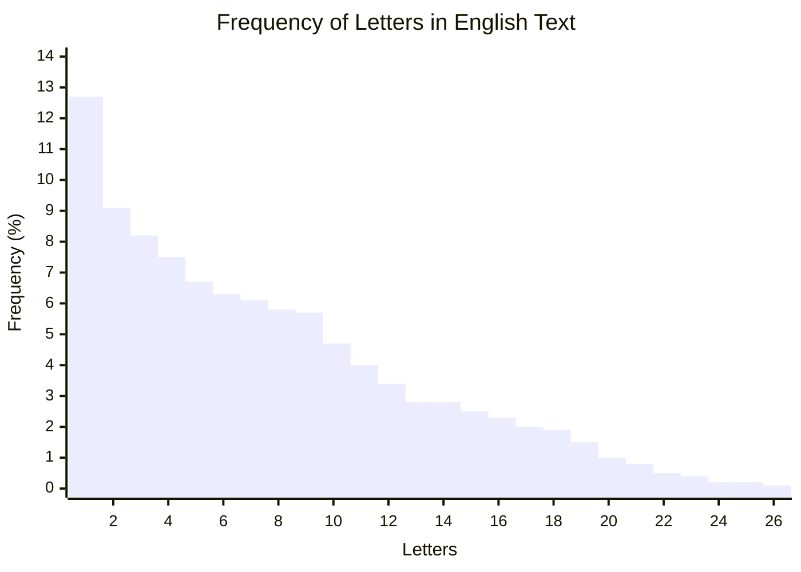

# Monoalphabetic Cipher

## Definition
A monoalphabetic cipher is a substitution cipher in which for a given key, the cipher alphabet for each plain alphabet is fixed throughout the encryption process. The receiver deciphers the message by performing the inverse substitution.

## Types of Monoalphabetic Ciphers

## Caesar Cipher

The Caesar Cipher is one of the earliest and simplest ciphers. It's a type of substitution cipher where each letter in the plaintext is shifted a certain number of places down or up the alphabet.

### Encryption Formula
C = (P + K) mod 26

Where:
- C is the ciphertext letter position (0-25)
- P is the plaintext letter position (0-25)
- K is the key (shift value)

### Decryption Formula
P = (C - K) mod 26

### Example

With a shift of K=3:

| Plaintext Alphabet | A | B | C | D | E | F | G | H | I | J | K | L | M | N | O | P | Q | R | S | T | U | V | W | X | Y | Z |
|-------------------|---|---|---|---|---|---|---|---|---|---|---|---|---|---|---|---|---|---|---|---|---|---|---|---|---|---|
| Ciphertext Alphabet | D | E | F | G | H | I | J | K | L | M | N | O | P | Q | R | S | T | U | V | W | X | Y | Z | A | B | C |

Plaintext: HELLO WORLD
Ciphertext: KHOOR ZRUOG

### Encryption Process Visualization

## Keyword Cipher

In a keyword cipher, the key is a word or phrase, and the cipher alphabet is constructed by first writing the keyword (removing any repeated letters) and then filling in the remaining letters of the alphabet in order.

### Example

Keyword: CRYPTO

Step 1: Remove duplicate letters from the keyword: CRYPTO

Step 2: Create the cipher alphabet:

| Plaintext Alphabet | A | B | C | D | E | F | G | H | I | J | K | L | M | N | O | P | Q | R | S | T | U | V | W | X | Y | Z |
|-------------------|---|---|---|---|---|---|---|---|---|---|---|---|---|---|---|---|---|---|---|---|---|---|---|---|---|---|
| Ciphertext Alphabet | C | R | Y | P | T | O | A | B | D | E | F | G | H | I | J | K | L | M | N | Q | S | U | V | W | X | Z |

Plaintext: HELLO WORLD
Ciphertext: BTGGJ VJMGR

## Cryptanalysis of Monoalphabetic Ciphers

Monoalphabetic ciphers are vulnerable to frequency analysis since the frequency distribution of letters in the ciphertext matches the distribution of the corresponding plaintext letters.

### English Letter Frequency

Legend (x-axis): E, T, A, O, I, N, S, H, R, D, L, U, C, M, F, W, Y, P, G, B, V, K, J, X, Q, Z

### Breaking a Monoalphabetic Cipher:

1. Count the frequency of each letter in the ciphertext
2. Compare with known letter frequencies in the expected language
3. Substitute high-frequency ciphertext letters with high-frequency plaintext letters
4. Look for patterns in common words or letter combinations
5. Refine the substitution table iteratively

## Advantages and Disadvantages

### Advantages
- Easy to implement
- Fast encryption and decryption process
- Suitable for educational purposes

### Disadvantages
- Very weak security
- Easily broken with frequency analysis
- No diffusion or confusion properties
- Limited key space (only 26! possible keys for English alphabet)
