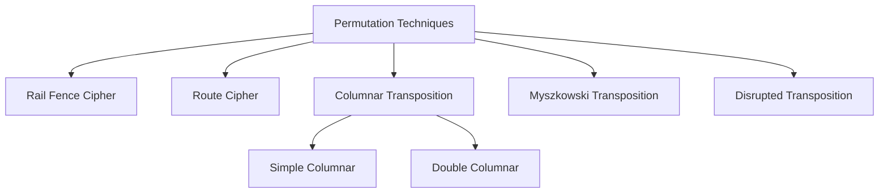
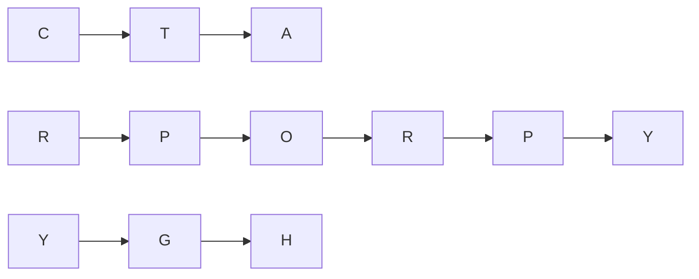
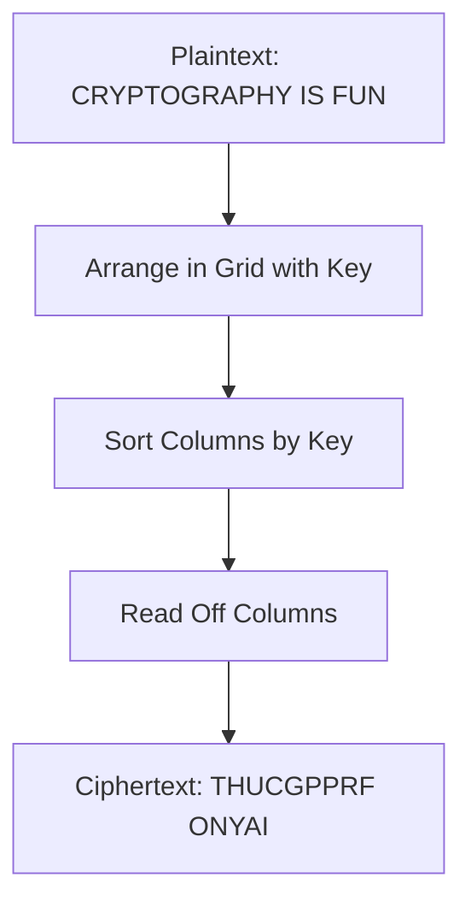
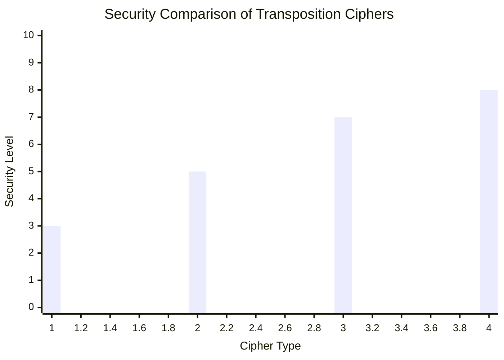

# Permutation Techniques (Transposition Ciphers)

## Definition
A permutation or transposition cipher rearranges the positions of characters in the plaintext without changing their identities. Unlike substitution ciphers which replace characters, transposition ciphers keep the same set of characters but shuffle their positions according to a specific algorithm.

## Key Characteristics

- Preserves character frequency distribution
- Changes the position of characters rather than their identity
- Usually involves arranging plaintext into a grid format
- Can be combined with substitution techniques for stronger encryption

## Types of Permutation Techniques



## Rail Fence Cipher

The Rail Fence cipher is a simple transposition cipher that gets its name from the way the plaintext is encoded. The plaintext is written in a zigzag pattern across multiple "rails" of an imaginary fence.

### Example

Plaintext: CRYPTOGRAPHY
Key: 3 (number of rails)

Writing the message in a rail fence pattern:

```
C . . . T . . . A . . .
. R . P . O . R . P . Y
. . Y . . . G . . . H .
```

Reading off by rows gives the ciphertext: CTARPORYPYGH

### Visual Representation



## Columnar Transposition Cipher

In a columnar transposition, the message is written out in rows of a fixed length, and then read out column by column. The columns are chosen in a scrambled order determined by a keyword.

### Example

Plaintext: CRYPTOGRAPHY IS FUN
Key: CIPHER

Step 1: Arrange the key letters alphabetically and note their positions:
C I P H E R
2 4 6 3 1 5

Step 2: Write the plaintext in rows under the key:
```
C I P H E R
2 4 6 3 1 5
-----------
C R Y P T O
G R A P H Y
 I S  F U N
```

Step 3: Read off the columns in order of the numbered key (1,2,3...):
1. Column E: THU
2. Column C: CG 
3. Column H: PP
4. Column I: RF
5. Column R: ON
6. Column P: YAI

Ciphertext: THUCGPPRF ONYAI (spaces added for clarity)

### Encryption Process Visualization



## Double Transposition

A double transposition cipher applies the columnar transposition twice, which significantly increases security.

### Example

Plaintext: CRYPTOGRAPHY IS FUN
First Key: CIPHER
Second Key: SECURE

After first transposition: THUCGPPRF ONYAI
After second transposition: HURFTP GISOCANY

## Block Transposition

In a block transposition cipher, the plaintext is divided into blocks of fixed size, and the positions within each block are shuffled according to a key.

### Example

Plaintext: CRYPTOGRAPHY
Block size: 4
Key: 3142 (meaning position 3 goes to position 1, position 1 goes to position 2, etc.)

Blocks: CRYP TOGR APHY
After transposition:
- YCPR (block 1)
- GTOR (block 2)
- YPHA (block 3)

Ciphertext: YCPRGTORYPAH

## Advantages and Disadvantages

### Advantages
- Preserves letter frequencies, which makes frequency analysis more difficult
- Can be combined with substitution ciphers to create more secure systems
- Relatively easy to implement

### Disadvantages
- Pure transposition ciphers are vulnerable to anagramming attacks
- Susceptible to known-plaintext attacks
- The key space can be limited compared to modern cryptographic systems

## Security Analysis



Legend:
- 3: Rail Fence
- 5: Simple Columnar
- 7: Double Columnar
- 8: Complex Route Cipher

## Modern Applications

While classical transposition ciphers are not secure by modern standards, their principles are incorporated into modern block ciphers like AES and DES. These modern algorithms use transposition (permutation) operations along with substitution to achieve confusion and diffusion—two properties identified by Claude Shannon as necessary for secure ciphers.
