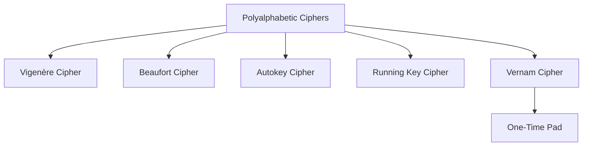
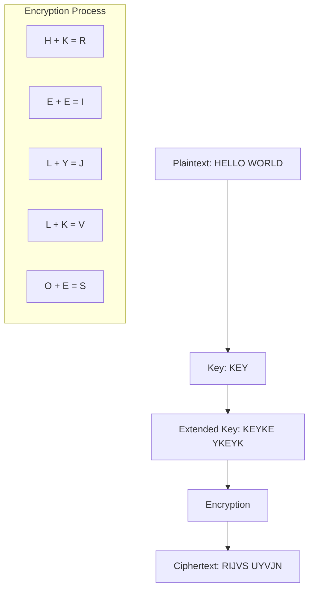
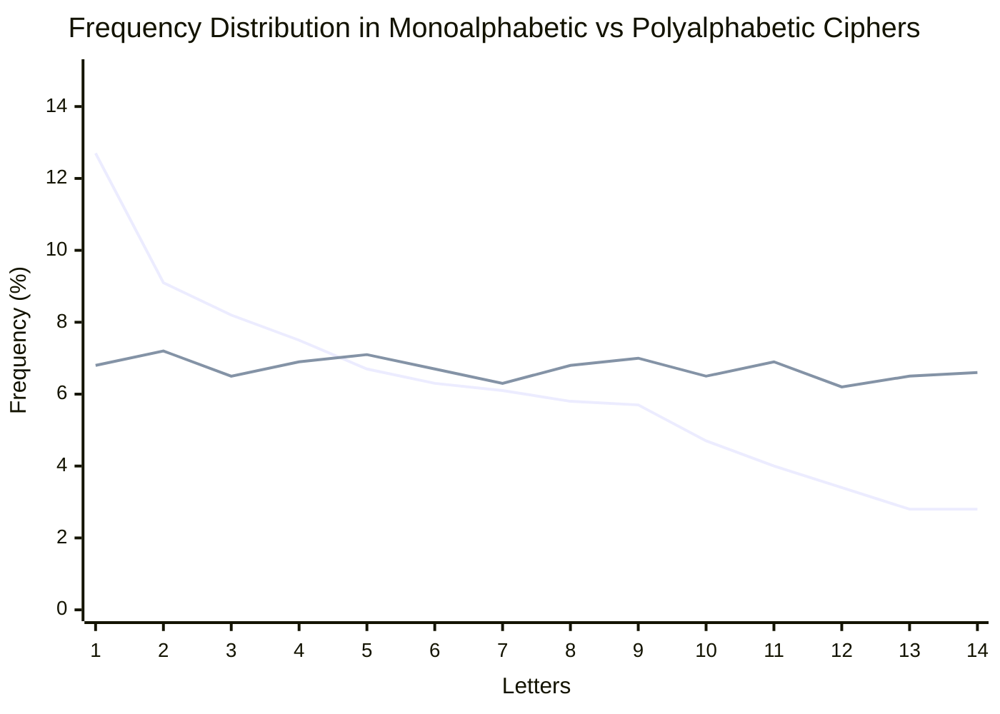

# Polyalphabetic Cipher

## Definition
A polyalphabetic cipher is a substitution cipher using multiple substitution alphabets. The Vigenère cipher is probably the best-known example of a polyalphabetic cipher, though it was broken by Kasiski in the 19th century.

## Key Characteristics

Unlike monoalphabetic substitution ciphers, where each character in the plaintext is mapped to a single character in the ciphertext, polyalphabetic ciphers use multiple substitution alphabets. This means the same plaintext letter can be encrypted to different ciphertext letters depending on its position in the message.

## Types of Polyalphabetic Ciphers



## Vigenère Cipher

The Vigenère cipher is a method of encrypting alphabetic text by using a simple form of polyalphabetic substitution. It uses a keyword to determine which Caesar cipher to use for each letter of the plaintext.

### Encryption Process

1. Choose a keyword and repeat it until it matches the length of the plaintext
2. For each letter in the plaintext:
   - Find the row in the Vigenère table corresponding to the keyword letter
   - Find the column corresponding to the plaintext letter
   - The intersection gives the ciphertext letter

### Vigenère Table

```
   | A B C D E F G H I J K L M N O P Q R S T U V W X Y Z
---+--------------------------------------------------
 A | A B C D E F G H I J K L M N O P Q R S T U V W X Y Z
 B | B C D E F G H I J K L M N O P Q R S T U V W X Y Z A
 C | C D E F G H I J K L M N O P Q R S T U V W X Y Z A B
 D | D E F G H I J K L M N O P Q R S T U V W X Y Z A B C
 E | E F G H I J K L M N O P Q R S T U V W X Y Z A B C D
 F | F G H I J K L M N O P Q R S T U V W X Y Z A B C D E
 G | G H I J K L M N O P Q R S T U V W X Y Z A B C D E F
 H | H I J K L M N O P Q R S T U V W X Y Z A B C D E F G
 I | I J K L M N O P Q R S T U V W X Y Z A B C D E F G H
 J | J K L M N O P Q R S T U V W X Y Z A B C D E F G H I
 K | K L M N O P Q R S T U V W X Y Z A B C D E F G H I J
 L | L M N O P Q R S T U V W X Y Z A B C D E F G H I J K
 M | M N O P Q R S T U V W X Y Z A B C D E F G H I J K L
 N | N O P Q R S T U V W X Y Z A B C D E F G H I J K L M
 O | O P Q R S T U V W X Y Z A B C D E F G H I J K L M N
 P | P Q R S T U V W X Y Z A B C D E F G H I J K L M N O
 Q | Q R S T U V W X Y Z A B C D E F G H I J K L M N O P
 R | R S T U V W X Y Z A B C D E F G H I J K L M N O P Q
 S | S T U V W X Y Z A B C D E F G H I J K L M N O P Q R
 T | T U V W X Y Z A B C D E F G H I J K L M N O P Q R S
 U | U V W X Y Z A B C D E F G H I J K L M N O P Q R S T
 V | V W X Y Z A B C D E F G H I J K L M N O P Q R S T U
 W | W X Y Z A B C D E F G H I J K L M N O P Q R S T U V
 X | X Y Z A B C D E F G H I J K L M N O P Q R S T U V W
 Y | Y Z A B C D E F G H I J K L M N O P Q R S T U V W X
 Z | Z A B C D E F G H I J K L M N O P Q R S T U V W X Y
```

### Example



Plaintext: HELLO WORLD
Key: KEYKEY KEYK (repeated to match plaintext length)
Ciphertext: RIJVS UYVJN

### Encryption Formula
C = (P + K) mod 26

Where:
- C is the ciphertext letter position (0-25)
- P is the plaintext letter position (0-25)
- K is the key letter position (0-25)

### Decryption Formula
P = (C - K) mod 26

## Beaufort Cipher

The Beaufort cipher is similar to the Vigenère cipher but uses a different encryption formula.

### Encryption/Decryption Formula
C = (K - P) mod 26 (same for both encryption and decryption)

### Example
Plaintext: HELLO
Key: CIPHER
Ciphertext: KCNDV

## Frequency Analysis Resistance

Polyalphabetic ciphers were designed to resist simple frequency analysis, as the same letter in the plaintext can be encrypted to different letters in the ciphertext.



Legend:
- Blue line: Typical frequency in monoalphabetic cipher (preserves plaintext frequency)
- Red line: Flattened frequency distribution in polyalphabetic cipher

## Cryptanalysis of Polyalphabetic Ciphers

### Kasiski Examination
A method for attacking polyalphabetic substitution ciphers, such as the Vigenère cipher:
1. Look for repeated sequences of characters in the ciphertext
2. Calculate the distances between repetitions
3. Find the greatest common divisor (GCD) of these distances
4. The GCD is likely to be the key length or a multiple of it

### Index of Coincidence (IC)
The IC measures the probability that two randomly selected letters from a text are the same. It helps in determining if a cipher is monoalphabetic or polyalphabetic.

- IC for random text: ~0.038
- IC for English language: ~0.067
- IC for monoalphabetic cipher: ~0.067
- IC for polyalphabetic cipher: closer to 0.038 (decreases as key length increases)

## Advantages and Disadvantages

### Advantages
- Stronger than monoalphabetic ciphers
- Resistant to simple frequency analysis
- Multiple substitution alphabets increase security

### Disadvantages
- Still vulnerable to advanced cryptanalysis techniques
- Key management can be challenging
- Longer keys are more secure but harder to remember
- Not secure by modern standards
