# Substitution Techniques

## Definition
Substitution cipher is a method of encryption where units of plaintext are replaced with ciphertext according to a fixed system. The "units" may be single letters, pairs of letters, triplets of letters, or mixtures of the above.

## Types of Substitution Techniques

```mermaid
graph TD
    A[Substitution Techniques] --> B[Monoalphabetic]
    A --> C[Polyalphabetic]
    B --> D[Caesar Cipher]
    B --> E[Keyword Cipher]
    B --> F[Atbash Cipher]
    C --> G[Vigenère Cipher]
    C --> H[Beaufort Cipher]
    C --> I[Playfair Cipher]
```



### 1. Monoalphabetic Substitution
In this technique, each letter of the plaintext is substituted by another letter to form the ciphertext. The relationship between a plaintext and ciphertext letter remains fixed throughout the encryption process.

### 2. Polyalphabetic Substitution
In this technique, multiple substitution alphabets are used instead of just one. The relationship between a plaintext and ciphertext letter varies throughout the encryption process.

## Key Characteristics

| Characteristic | Description |
|----------------|-------------|
| Fixed mapping | Each plaintext character maps to exactly one ciphertext character |
| Key-based | The substitution pattern is determined by a key |
| Character-level | Operates on individual characters or small groups |
| Pattern preservation | Letter frequencies are preserved in monoalphabetic ciphers |

## Security Analysis

The security of substitution ciphers can be evaluated by several factors:

```mermaid
xychart-beta
    title "Security of Different Substitution Ciphers"
    x-axis "Cipher Types"
    y-axis "Security Level" 0 --> 10
    bar [3, 7, 9]
    line [3, 7, 9]
    point [3, 7, 9]
```

Legend:
- 3: Simple Monoalphabetic
- 7: Complex Monoalphabetic
- 9: Polyalphabetic

## Advantages and Disadvantages

### Advantages
- Easy to implement and understand
- Can be performed manually without complex calculations
- Polyalphabetic variants offer reasonable security against basic frequency analysis

### Disadvantages
- Monoalphabetic substitution is vulnerable to frequency analysis
- Pattern recognition can break many substitution ciphers
- Key distribution and management can be challenging
