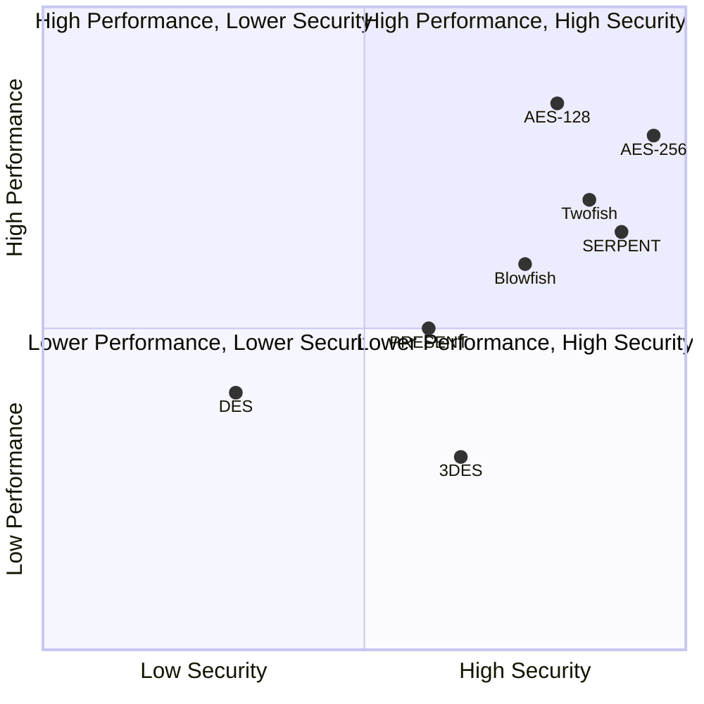

# Feistel Cipher vs Substitution-Permutation Network (SPN)

## Introduction

Block ciphers are fundamental building blocks in symmetric cryptography. Two dominant design paradigms have emerged over the years: Feistel Networks and Substitution-Permutation Networks (SPNs). This document provides a comprehensive comparison between these two approaches, highlighting their structures, advantages, disadvantages, and applications.

## Structural Comparison

### Basic Structure

```mermaid
%%{init: {'theme': 'base', 'themeVariables': { 'primaryColor': '#f9f9f9', 'primaryBorderColor': '#AAAAAA', 'secondaryColor': '#f1f1f1', 'tertiaryColor': '#white'}}}%%
graph TB
    subgraph "Feistel Network"
        FA[Input Block] --> FB[Split into L₀, R₀]
        FB --> FC[L₁ = R₀]
        FB --> FD{F}
        FE[Round Key K₁] --> FD
        FD --> FF[⊕]
        FB --> FF
        FF --> FG[R₁ = L₀ ⊕ F(R₀, K₁)]
        FC & FG --> FH[Next Round]
    end
    
    subgraph "SPN Structure"
        SA[Input Block] --> SB[Key Addition - XOR with K₀]
        SB --> SC[Substitution Layer - S-boxes]
        SC --> SD[Permutation Layer]
        SD --> SE[Key Addition - XOR with K₁]
        SE --> SF[Next Round]
    end
```

### Mathematical Representation

**Feistel Network**:
For round i:
$$ L_{i+1} = R_i $$
$$ R_{i+1} = L_i \oplus F(R_i, K_i) $$

**Substitution-Permutation Network**:
For round i:
$$ X_i = K_i \oplus P(S(X_{i-1} \oplus K_{i-1})) $$

Where:
- $L_i, R_i$ represent left and right halves in Feistel
- $X_i$ represents the full state in SPN
- $F, S, P$ are the round function, substitution function, and permutation function
- $K_i$ represents round keys

## Key Differences

| Aspect | Feistel Network | SPN |
|--------|----------------|-----|
| Data Processing | Processes half the block in each round | Processes the entire block in each round |
| Round Function | Only needs to be one-way (not necessarily invertible) | Must use invertible components |
| Encryption/Decryption | Same structure with reversed key schedule | Different inverse operations required |
| Implementation | Single implementation for both directions | May require separate implementations |
| Diffusion Speed | Typically slower (multiple rounds for complete diffusion) | Typically faster (can achieve complete diffusion in fewer rounds) |
| Parallelism | Limited parallelism within rounds | Higher degree of parallelism possible |
| Notable Examples | DES, Triple-DES, Blowfish, Twofish, CAST | AES (Rijndael), PRESENT, SERPENT |

## Theoretical Security Considerations

### Confusion and Diffusion

Claude Shannon identified two properties necessary for secure ciphers:

1. **Confusion**: Complex relationship between key and ciphertext
2. **Diffusion**: Each plaintext bit should influence many ciphertext bits

Comparing how these networks achieve these properties:

**Feistel Network**:
- Confusion comes from the round function F
- Diffusion develops gradually, requiring multiple rounds
- Only half the block is directly modified in each round

**SPN**:
- Confusion comes from the substitution layer (S-boxes)
- Diffusion comes from the permutation layer
- Can achieve complete diffusion in fewer rounds
- Entire block is modified in each round

### Security Proofs

Feistel networks have been more thoroughly analyzed from a theoretical standpoint. The Luby-Rackoff theorem proves that a 3-round Feistel network with random round functions is a secure pseudorandom permutation, and a 4-round network is a strong pseudorandom permutation.

SPNs do not have comparable general security proofs, but specific SPNs like AES have undergone extensive security analysis.

## Performance Characteristics

### Computational Efficiency

```math
\begin{array}{|c|c|}
\hline
\textbf{Feistel Network} & \textbf{SPN} \\
\hline
\text{Round function applied to half block} & \text{Operations applied to entire block} \\
\text{Typically requires more rounds} & \text{Typically requires fewer rounds} \\
\text{Round function can be computationally intensive} & \text{S-boxes are table lookups (fast)} \\
\hline
\end{array}
```

### Hardware Implementation

**Feistel Network**:
- Compact implementation (reuse same hardware for encryption/decryption)
- Potentially fewer resources required
- Limited parallellization within rounds

**SPN**:
- May require separate circuits for encryption and decryption
- Highly parallelizable operations
- Well-suited for pipelined hardware implementations

### Software Implementation

**Feistel Network**:
- Simple structure
- Flexible round function design
- Same code paths for encryption and decryption
- May require more rounds, affecting performance

**SPN**:
- Table lookups for S-boxes can be very efficient
- Permutations can be implemented efficiently on modern processors
- Different code paths for encryption and decryption
- Fewer rounds typically required

## Resistance to Cryptanalysis

### Differential and Linear Cryptanalysis

Both structures can be designed to resist these attacks, but they use different approaches:

**Feistel Network**:
- Security relies on the round function's resistance to cryptanalysis
- The XOR with the left half helps prevent differential attacks
- Typically needs more rounds for equivalent security

**SPN**:
- Security relies heavily on S-box properties
- The permutation layer spreads differences quickly
- Can achieve resistance to differential/linear attacks in fewer rounds

### Side-Channel Attacks

**Feistel Network**:
- Can be vulnerable to timing attacks if the round function has variable execution time
- Generally simpler to implement in constant time

**SPN**:
- Table lookups (S-boxes) can lead to cache timing vulnerabilities
- More complex to implement in constant time

## Implementation Flexibility

### Round Function/S-box Design

**Feistel Network**:
- Round function can be arbitrarily complex
- Does not need to be invertible
- Easier to design and modify

**SPN**:
- S-boxes must be invertible
- S-box design is mathematically complex
- Specific cryptographic properties must be satisfied

### Key Schedule

Both structures require a key schedule to derive round keys from the master key. The security of both depends significantly on the quality of this key schedule.

## Practical Examples and Performance

### Benchmark Comparison (Symbolic)

```
Speed comparison on modern CPU (higher is better):
            |-----|-----|-----|-----|-----|
AES (SPN)   |███████████████████████████    |
DES (Feistel)|█████████                     |
            |-----|-----|-----|-----|-----|
            0     20    40    60    80   100%
```

### Application Suitability

**Feistel Network best for**:
- Environments where code size is critical
- When identical encryption/decryption paths are advantageous
- When round function flexibility is needed
- Legacy systems compatibility (e.g., DES compatibility)

**SPN best for**:
- High-performance requirements
- Hardware acceleration
- When fewer rounds are preferred
- Modern systems with parallel processing capabilities

## Case Studies

### DES (Feistel) vs AES (SPN)

**DES (Data Encryption Standard)**:
- 16-round Feistel structure
- 56-bit key (effectively)
- 64-bit block size
- Developed in the 1970s
- Vulnerable to brute force attacks today

**AES (Advanced Encryption Standard)**:
- 10/12/14-round SPN structure (depending on key size)
- 128/192/256-bit keys
- 128-bit block size
- Developed in the late 1990s
- Currently the global standard for symmetric encryption

### Performance and Security Tradeoffs



## Evolution and Future Trends

### Historical Context

The evolution of block cipher design shows a shift from Feistel networks (dominant in the 1970s-1990s) to SPNs (dominant from 2000s onward). This shift reflects advances in understanding of cryptographic design principles and changes in computing capabilities.

### Future Directions

Current trends point toward:
1. Lightweight cryptography (resource-constrained devices)
2. Post-quantum considerations
3. Side-channel resistance
4. Flexibility for diverse platforms

Both structures continue to evolve, with hybrid designs emerging that combine advantages of each approach.

## Conclusion

The choice between Feistel networks and SPNs involves tradeoffs in security, performance, implementation complexity, and application requirements. Neither structure is universally superior to the other.

**Feistel Networks excel in**:
- Simplicity of design
- Identical encryption/decryption structure
- Flexibility in round function design
- Proven theoretical security properties

**SPNs excel in**:
- Performance efficiency
- Achieving confusion and diffusion quickly
- Parallelizability
- Meeting modern security requirements with fewer rounds

The continued development of both structures and hybrid approaches ensures that block cipher design remains a vibrant area of cryptographic research, adapting to new security challenges and implementation environments.
