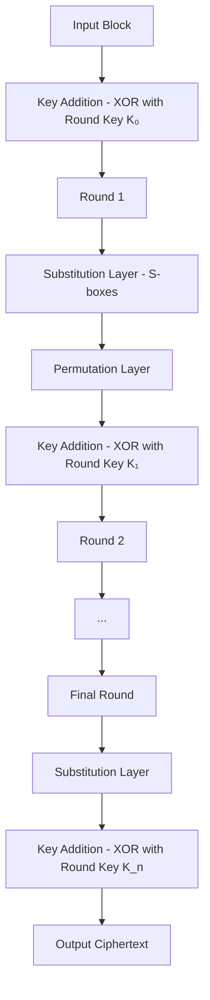

# Substitution-Permutation Network (SPN)

## Introduction

A Substitution-Permutation Network (SPN) is a mathematical structure used in block cipher design. It forms the foundation for many modern encryption algorithms, most notably the Advanced Encryption Standard (AES). The SPN structure alternates layers of substitution (S-boxes) and permutation (P-boxes) to create confusion and diffusion—two essential properties identified by Claude Shannon for secure ciphers.

## Structure and Working

An SPN typically consists of multiple rounds, where each round includes three operations:

1. **Key Mixing**: The round key is XORed with the data block
2. **Substitution Layer**: The data is divided into smaller blocks and passed through substitution boxes (S-boxes)
3. **Permutation Layer**: The bits are rearranged according to a fixed permutation pattern

In the final round, the permutation step is often replaced with another key mixing operation.



### Mathematical Representation

For each round i:
$$ X_i = K_i \oplus P(S(X_{i-1} \oplus K_{i-1})) $$

Where:
- $X_i$ is the state after round i
- $K_i$ is the round key for round i
- $S$ is the substitution function
- $P$ is the permutation function
- $\oplus$ is the XOR operation

## Substitution Boxes (S-boxes)

S-boxes are the nonlinear components of an SPN. They take a small number of input bits (typically 4 or 8) and transform them into output bits of the same size according to a fixed lookup table. 

A good S-box has these properties:
1. Nonlinearity (resistance to linear cryptanalysis)
2. Differential uniformity (resistance to differential cryptanalysis)
3. Avalanche effect (small input changes cause significant output changes)
4. Bijective mapping (invertible function)

### Example of a 4×4 S-box:
```
Input:  0 1 2 3 4 5 6 7 8 9 A B C D E F
Output: E 4 D 1 2 F B 8 3 A 6 C 5 9 0 7
```

This means that input value 0 is substituted with E, input 1 with 4, and so on.

## Permutation Layer (P-box)

The permutation layer rearranges the bits of the state according to a fixed pattern. This provides diffusion, spreading the influence of each input bit across many output bits.

For example, in a 16-bit block with bits numbered 0-15, a permutation might be:
```
Input position:  0  1  2  3  4  5  6  7  8  9 10 11 12 13 14 15
Output position: 0  4  8 12  1  5  9 13  2  6 10 14  3  7 11 15
```

This means that the bit at position 1 moves to position 4, the bit at position 2 moves to position 8, and so on.

## Example: Simple SPN

Let's consider a simplified SPN with:
- 16-bit block size
- 4-bit S-boxes (4 S-boxes per round)
- 2 rounds
- Simple bit permutation
- Round keys K₀ = 0x1234, K₁ = 0x5678, K₂ = 0x9ABC

### S-box Lookup Table:
```
Input:  0 1 2 3 4 5 6 7 8 9 A B C D E F
Output: E 4 D 1 2 F B 8 3 A 6 C 5 9 0 7
```

### Permutation Rule:
```
Input:  0  1  2  3  4  5  6  7  8  9 10 11 12 13 14 15
Output: 0  4  8 12  1  5  9 13  2  6 10 14  3  7 11 15
```

### Encryption Process:

Input plaintext: 0x2D5F

Initial key mixing:
- 0x2D5F ⊕ 0x1234 = 0x3F6B

Round 1:

1. Substitution (dividing into 4-bit blocks and applying S-box):
   - 0x3 → 0x1
   - 0xF → 0x7
   - 0x6 → 0xB
   - 0xB → 0xC
   - New state: 0x17BC

2. Permutation (rearranging bits):
   - Apply bit permutation to 0x17BC
   - Result: 0x1CB7

3. Key mixing (XOR with K₁):
   - 0x1CB7 ⊕ 0x5678 = 0x4ACF

Round 2:

1. Substitution:
   - 0x4 → 0x2
   - 0xA → 0x6
   - 0xC → 0x5
   - 0xF → 0x7
   - New state: 0x2657

2. Final key mixing (XOR with K₂):
   - 0x2657 ⊕ 0x9ABC = 0xBCEB

Output ciphertext: 0xBCEB

### Decryption Process:

Decryption follows the inverse operations in reverse order:
1. Inverse key mixing
2. Inverse permutation
3. Inverse substitution

## Advantages of SPN

1. **High Diffusion Rate**: The permutation layer spreads changes quickly throughout the entire state.

2. **Parallelizable Structure**: S-boxes can be processed in parallel, making hardware implementation efficient.

3. **Proven Security**: When properly designed, SPNs offer strong resistance against known cryptanalytic attacks.

4. **Flexibility in Design**: The size and properties of S-boxes and permutations can be tailored for specific security and performance requirements.

5. **Efficiency in Modern Processors**: Operations like substitution through lookup tables and bit permutations can be implemented efficiently.

## Disadvantages of SPN

1. **Different Encryption and Decryption Paths**: Unlike Feistel networks, SPNs typically require separate implementations for encryption and decryption.

2. **S-box Design Complexity**: Creating cryptographically strong S-boxes is challenging and requires significant mathematical analysis.

3. **Implementation Vulnerability**: Without careful implementation, SPNs can be vulnerable to side-channel attacks like timing and power analysis.

4. **Resource Requirements**: Storing S-box lookup tables may require significant memory in constrained environments.

## Security Considerations

The security of an SPN depends on:

1. **S-box Cryptographic Properties**: Resistance to linear and differential cryptanalysis.

2. **Number of Rounds**: Sufficient rounds must be used to prevent attacks (e.g., AES uses 10, 12, or 14 rounds depending on key size).

3. **Key Schedule**: The derivation of round keys should avoid related-key vulnerabilities.

4. **Structure of Permutation Layer**: Must provide complete diffusion within a minimal number of rounds.

## Real-World Applications

1. **Advanced Encryption Standard (AES)**: The most widely used SPN-based cipher, replacing DES as the global encryption standard.

2. **PRESENT**: A lightweight block cipher designed for constrained hardware environments.

3. **SERPENT**: A highly secure block cipher that was an AES finalist.

4. **SHARK**: A precursor to AES with similar structural elements.

## The AES Special Case

AES is a specialized SPN where:

1. The state is organized as a 4×4 matrix of bytes
2. The S-box is based on mathematical operations in a finite field
3. The permutation layer is split into two operations:
   - ShiftRows (cyclically shifts rows)
   - MixColumns (matrix multiplication in GF(2⁸))

This design achieves exceptionally good diffusion properties.

```math
\begin{bmatrix}
a_{0,0} & a_{0,1} & a_{0,2} & a_{0,3} \\
a_{1,0} & a_{1,1} & a_{1,2} & a_{1,3} \\
a_{2,0} & a_{2,1} & a_{2,2} & a_{2,3} \\
a_{3,0} & a_{3,1} & a_{3,2} & a_{3,3}
\end{bmatrix}
```

## Conclusion

Substitution-Permutation Networks represent one of the most important structures in modern block cipher design. With their strong security properties and efficient implementation characteristics, they form the basis of many current encryption standards, most notably AES. The design principles of SPNs continue to influence new cryptographic algorithms, particularly in lightweight cryptography for constrained environments.
