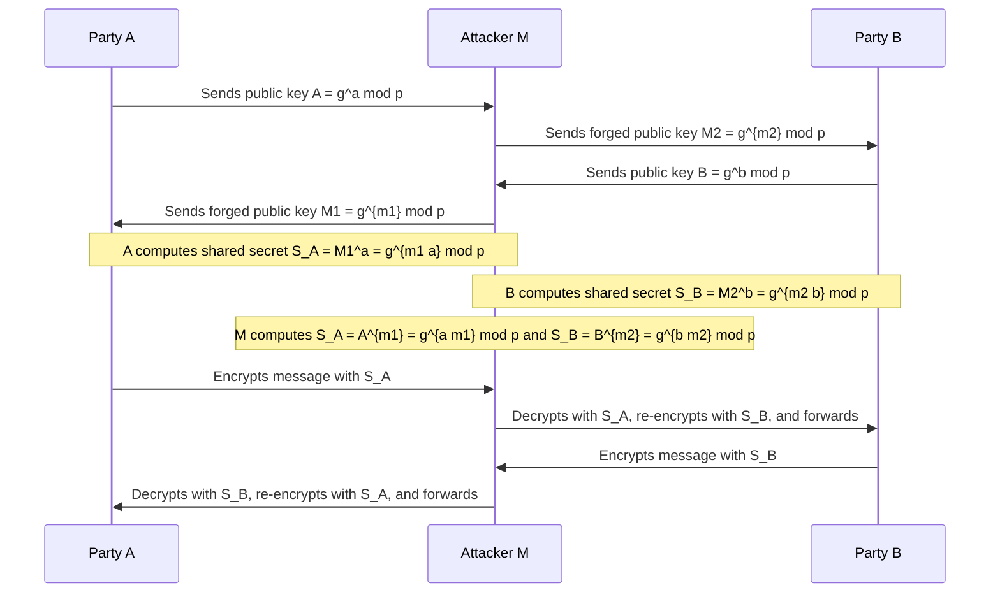

A **Man-in-the-Middle (MITM) Attack** is a type of cyberattack where an attacker secretly intercepts and potentially alters the communication between two parties who believe they are directly communicating with each other. This attack is particularly dangerous in protocols like the **Diffie-Hellman Key Exchange (DHKE)**, where the attacker can impersonate both parties and establish separate shared secrets with each.

Below is an explanation of the MITM attack on the Diffie-Hellman Key Exchange, along with a **Mermaid diagram** to visualize the process.

---

### **How MITM Attack Works in Diffie-Hellman Key Exchange**
1. **Normal DHKE Flow**:
   - Party \( A \) and Party \( B \) exchange public keys \( A = g^a \mod p \) and \( B = g^b \mod p \).
   - They compute the shared secret \( S = g^{ab} \mod p \).

2. **MITM Attack Flow**:
   - The attacker \( M \) intercepts the communication between \( A \) and \( B \).
   - \( M \) generates their own private keys \( m_1 \) and \( m_2 \) and computes public keys \( M_1 = g^{m_1} \mod p \) and \( M_2 = g^{m_2} \mod p \).
   - \( M \) sends \( M_1 \) to \( A \) (pretending to be \( B \)) and \( M_2 \) to \( B \) (pretending to be \( A \)).
   - \( A \) computes a shared secret \( S_A = M_1^a = g^{m_1 a} \mod p \) with \( M \).
   - \( B \) computes a shared secret \( S_B = M_2^b = g^{m_2 b} \mod p \) with \( M \).
   - \( M \) computes both \( S_A = A^{m_1} = g^{a m_1} \mod p \) and \( S_B = B^{m_2} = g^{b m_2} \mod p \).
   - Now, \( M \) can decrypt, read, and modify messages between \( A \) and \( B \).

---

### **Mermaid Diagram**
Below is a Mermaid diagram illustrating the MITM attack on the Diffie-Hellman Key Exchange:

---

### **Explanation of the Diagram**
1. **Step 1**: Party \( A \) sends its public key \( A = g^a \mod p \) to Party \( B \), but the attacker \( M \) intercepts it.
2. **Step 2**: \( M \) sends a forged public key \( M_2 = g^{m_2} \mod p \) to \( B \), pretending to be \( A \).
3. **Step 3**: Party \( B \) sends its public key \( B = g^b \mod p \) to Party \( A \), but \( M \) intercepts it.
4. **Step 4**: \( M \) sends a forged public key \( M_1 = g^{m_1} \mod p \) to \( A \), pretending to be \( B \).
5. **Step 5**: \( A \) and \( B \) compute shared secrets with \( M \) instead of each other.
6. **Step 6**: \( M \) can now decrypt, read, and modify all messages between \( A \) and \( B \).

---

### **Preventing MITM Attacks**
To prevent MITM attacks in protocols like DHKE:
1. Use **authenticated key exchange** (e.g., digital signatures or certificates) to verify the identity of the parties.
2. Use **TLS/SSL** to encrypt and authenticate communication.
3. Employ **public key infrastructure (PKI)** to ensure the authenticity of public keys.

The MITM attack highlights the importance of authentication in cryptographic protocols. Without authentication, even secure key exchange algorithms like Diffie-Hellman are vulnerable.
