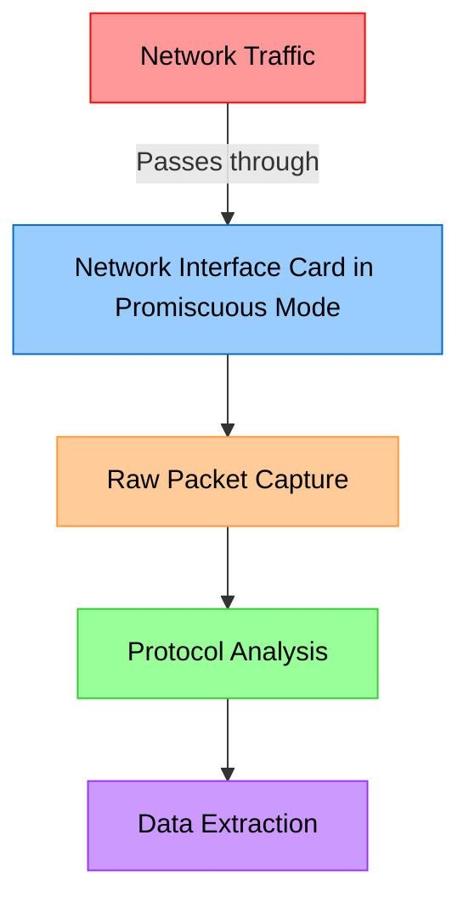
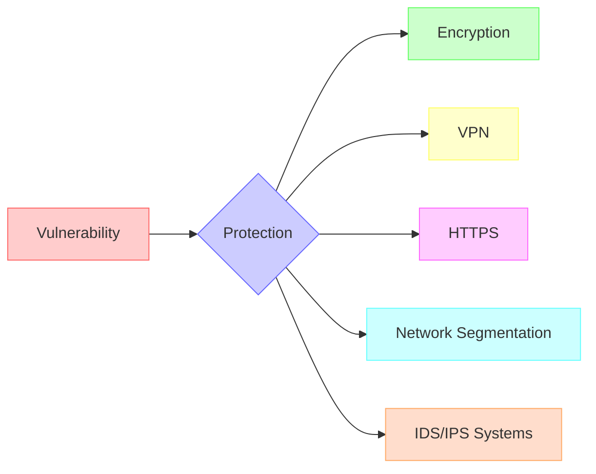
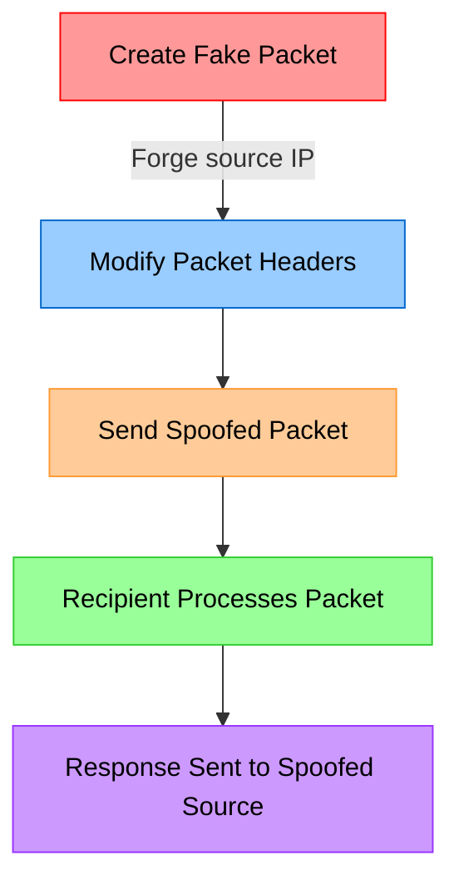
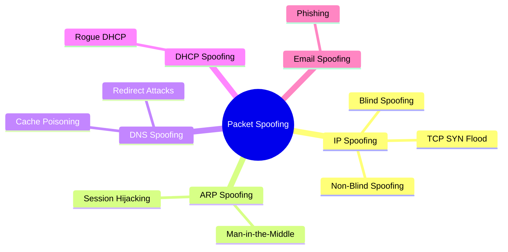
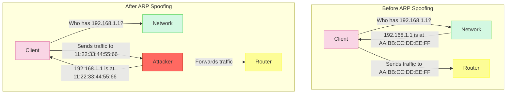
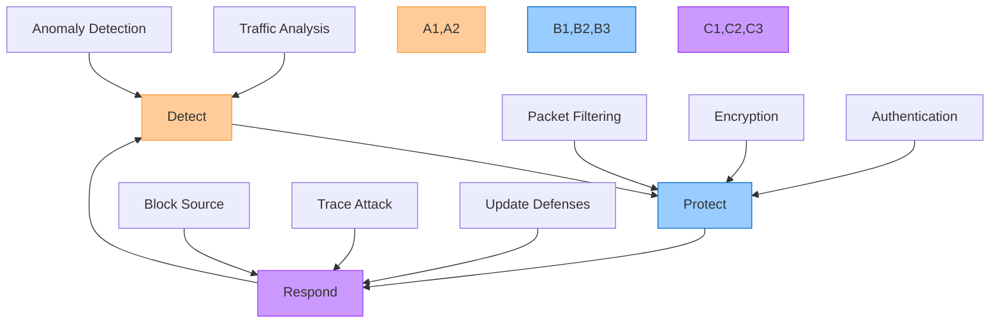
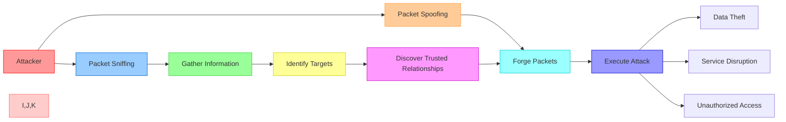

# Packet Sniffing and Packet Spoofing

## Packet Sniffing

### What is Packet Sniffing?

Packet sniffing is a technique used to capture and inspect data packets as they travel across a network. Network packets contain various information including source and destination addresses, protocol information, and actual data being transmitted. Packet sniffers (also called network analyzers or protocol analyzers) are tools designed to intercept and log this network traffic.

### How Packet Sniffing Works



### Packet Sniffing Process

```mermaid
sequenceDiagram
    participant U as User
    participant S as Server
    participant A as Attacker
    
    Note over A: Deploys sniffer on network
    U->>S: Request (unencrypted)
    Note over A: Captures packet
    S->>U: Response (unencrypted)
    Note over A: Captures packet
    Note over A: Analyzes captured data
    
    style U fill:#f9d5e5
    style S fill:#d3f8e2
    style A fill:#fce1e4
```

### Types of Packet Sniffers

1. **Active Sniffers**: These actively inject packets into the network to facilitate sniffing.
2. **Passive Sniffers**: These only monitor traffic without introducing any new packets.

### Common Packet Sniffing Tools

- **Wireshark**: Open-source, feature-rich packet analyzer
- **tcpdump**: Command-line packet analyzer
- **Ettercap**: Comprehensive suite for man-in-the-middle attacks
- **Kismet**: Wireless network detector and sniffer

### Legitimate Uses of Packet Sniffing

- Network troubleshooting and monitoring
- Network performance optimization
- Security testing and verification
- Protocol development and debugging

### Malicious Uses of Packet Sniffing

- Stealing unencrypted credentials
- Capturing sensitive information
- Session hijacking
- Corporate espionage

### Protection Against Packet Sniffing



## Packet Spoofing

### What is Packet Spoofing?

Packet spoofing is a technique where an attacker falsifies the source address or other packet information to impersonate another system. By fabricating the origin of data packets, attackers can bypass security controls, redirect traffic, or hide their identity during malicious activities.

### How Packet Spoofing Works



### Common Packet Spoofing Attacks



### IP Spoofing Example

```mermaid
sequenceDiagram
    participant V as Victim
    participant A as Attacker
    participant T as Trusted Server
    
    A->>T: Packet with spoofed source IP (Victim's IP)
    T->>V: Response to legitimate IP
    Note over V: Receives unexpected traffic
    Note over A: May not see response<br>but attack still succeeds
    
    style V fill:#f9d5e5
    style A fill:#fce1e4
    style T fill:#d3f8e2
```

### ARP Spoofing Attack



### Protection Against Packet Spoofing

1. **Ingress and Egress Filtering**: Filter incoming and outgoing packets based on source/destination addresses
2. **Authentication**: Implement strong authentication mechanisms
3. **Encryption**: Use encrypted protocols (SSH, TLS/SSL)
4. **Packet Filtering**: Configure firewalls to block suspicious packets
5. **Network Monitoring**: Implement IDS/IPS to detect spoofing attempts



## Comparison of Packet Sniffing and Packet Spoofing

| Aspect | Packet Sniffing | Packet Spoofing |
|--------|----------------|-----------------|
| **Purpose** | Capturing and analyzing packets | Falsifying packet information |
| **Activity Type** | Passive (typically) | Active |
| **Detection** | Difficult to detect | Can be detected with proper monitoring |
| **Common Tools** | Wireshark, tcpdump | Scapy, hping3 |
| **Primary Defense** | Encryption | Filtering and authentication |
| **OSI Layer** | Primarily Data Link Layer | Network and Transport Layers |
| **Primary Goal** | Information gathering | Impersonation or denial of service |
| **Legal Status** | Legal for network admins on own networks | Typically illegal without authorization |

## Combined Attack Scenario

Attackers often use both packet sniffing and packet spoofing together to execute sophisticated attacks.



## Conclusion

Both packet sniffing and packet spoofing represent significant security concerns in modern networks. Understanding how these techniques work is essential for cybersecurity professionals to develop effective countermeasures and protect network infrastructure from potential attacks.
